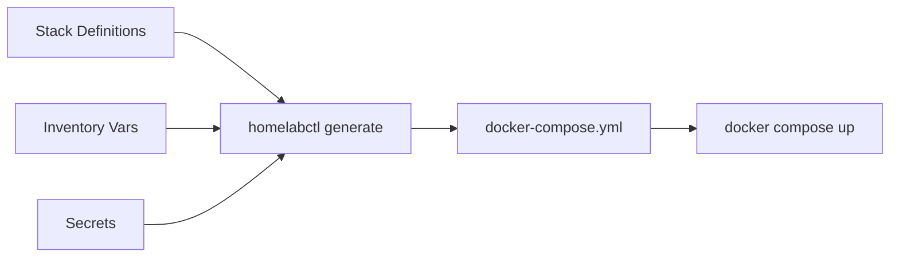

# homelabctl

<div class="grid cards" markdown>

-   :material-rocket-launch:{ .lg .middle } __Simple & Powerful__

    ---

    No complex orchestration platforms. Just Docker Compose with declarative configuration.

-   :material-lock:{ .lg .middle } __Secure by Default__

    ---

    Built-in SOPS encryption for secrets. Keep sensitive data safe.

-   :material-refresh:{ .lg .middle } __Reproducible__

    ---

    Version control your entire homelab. Same input = same output, always.

-   :material-puzzle:{ .lg .middle } __Flexible Templates__

    ---

    Powerful templating with gomplate. Customize everything.

</div>

## What is homelabctl?

**homelabctl** is a CLI tool for managing Docker stacks in your homelab using declarative, template-based configuration.

Think of it as a **compiler for your homelab**: it transforms static stack definitions into runtime Docker Compose configurations.

## Key Features

- ✅ **Declarative Configuration** - Infrastructure as code for your homelab
- ✅ **Template-Based** - Powered by gomplate for flexible templates
- ✅ **Dependency Management** - Automatic validation of stack dependencies
- ✅ **Secrets Support** - Automatic SOPS decryption for encrypted secrets
- ✅ **Category System** - Organize stacks with automatic deployment ordering
- ✅ **Service-Level Control** - Disable individual services without disabling stacks
- ✅ **Docker Compose Passthrough** - Full access to all docker compose commands
- ✅ **Fail-Fast** - Clear errors with actionable suggestions

## Quick Example

```bash
# Initialize your homelab
mkdir ~/homelab && cd ~/homelab
homelabctl init

# Configure your domain
echo "domain: homelab.local" > inventory/vars.yaml

# Enable and deploy a stack
homelabctl enable traefik
homelabctl deploy

# Check status
homelabctl ps
```

That's it! Your first service is running.

## Architecture Overview



homelabctl acts as a compiler:

1. **Input**: Stack definitions + inventory + secrets
2. **Process**: Template rendering + variable merging + validation
3. **Output**: Single `docker-compose.yml` file
4. **Deploy**: Standard Docker Compose commands

## Why homelabctl?

### For Homelabbers

- 🏠 Perfect for single-node home servers
- 📦 Simpler than Kubernetes, more powerful than plain Docker Compose
- 🔄 Reproducible infrastructure - backup your config, restore anywhere
- 🎯 Declarative - define what you want, not how to get there

### For Developers

- 🧪 Test entire stacks locally before deployment
- 📝 Version control everything
- 🔐 Secrets management built-in
- 🛠️ Extensible architecture

## Next Steps

<div class="grid cards" markdown>

-   :material-download:{ .lg .middle } [__Installation__](getting-started/installation.md)

    ---

    Install homelabctl on your system

-   :material-run-fast:{ .lg .middle } [__Quick Start__](getting-started/quickstart.md)

    ---

    Get up and running in 5 minutes

-   :material-book-open:{ .lg .middle } [__User Guide__](guide/commands.md)

    ---

    Learn all the features and commands

-   :material-code-braces:{ .lg .middle } [__Contributing__](contributing/how-to-contribute.md)

    ---

    Help improve homelabctl

</div>

## Community

- [GitHub Discussions](https://github.com/monkeymonk/homelabctl/discussions) - Ask questions and share ideas
- [GitHub Issues](https://github.com/monkeymonk/homelabctl/issues) - Report bugs or request features
- [Contributing Guide](contributing/how-to-contribute.md) - Help improve the project

---

!!! tip "Star the project"
    If you find homelabctl useful, consider [⭐ starring it on GitHub](https://github.com/monkeymonk/homelabctl)!
